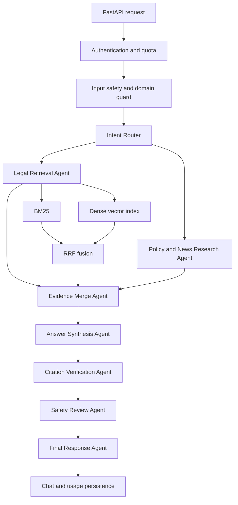

# MaiThuyLaw AI

MaiThuyLaw AI is a production-oriented Vietnamese legal information assistant focused on drug-related law, public policy, and verified official news. It combines a deterministic multi-agent workflow, hybrid retrieval, citation verification, safety controls, persistent chat history, and token-based usage accounting.

> The system provides legal information and source-grounded summaries. It does not replace advice from a qualified lawyer or an authoritative agency.

## What is implemented

- FastAPI application with `/ask`, `/api/chat`, `/health`, `/ready`, `/history`, and `/usage` APIs.
- Intent-aware multi-agent workflow for retrieval, policy/news research, evidence merging, synthesis, citation verification, safety review, and final response preparation.
- Hybrid retrieval using BM25 plus a deterministic 384-dimensional dense vector index, fused with Reciprocal Rank Fusion.
- A controlled dataset containing legal, policy, and verified-news sources.
- Claim-level citation validation for invalid source IDs, unsupported claims, and legal conclusions backed only by non-legal sources.
- Gemini synthesis when configured, with an extractive and cited fallback when no model key is available.
- Optional controlled search restricted to approved official or trusted domains and requiring explicit user consent.
- API-key restricted mode or signed anonymous sessions for a public demo.
- Redis-backed chat history, quotas, and token/cost accounting with local JSON fallback for development.
- File and URL ingestion controls, official-domain allowlisting, size/type validation, and SSRF protection.
- Docker and Railway configuration, CI release gates, retrieval evaluation, and smoke tests.

## Architecture



Detailed design: [`docs/architecture.md`](docs/architecture.md).

## Dataset and retrieval

Current validated index:

| Metric | Value |
|---|---:|
| Chunks | 224 |
| Documents | 27 |
| Legal chunks | 182 |
| Policy chunks | 14 |
| News chunks | 28 |
| Dense dimensions | 384 |

The dense index is generated deterministically during Docker build or local validation and persisted at:

```text
data/maithuylaw_dataset/data/index/dense_index.npz
```

The small repository regression benchmark currently reports R@3, R@5, and MRR of `1.0` for both the BM25 baseline and the hybrid pipeline. This benchmark is a release regression set, not a claim of general legal-QA accuracy. See [`docs/retrieval-evaluation.md`](docs/retrieval-evaluation.md).

## Local setup

Requirements:

- Python 3.12+
- Node.js 20+
- Redis is recommended for shared production persistence but optional for local development

```bash
python -m venv .venv
source .venv/bin/activate          # Windows: .venv\Scripts\activate
pip install -r requirements.txt

cd frontend
npm ci
npm run build
cd ..

python -m uvicorn backend.main:app --host 0.0.0.0 --port 8000
```

Readiness:

```bash
curl http://localhost:8000/health
curl http://localhost:8000/ready
```

## Environment variables

Copy `.env.example` to `.env.local` for local use. Do not commit real secrets.

Required for model synthesis:

```text
GEMINI_API_KEY
GEMINI_MODEL=gemini-3.1-flash-lite
```

Required for a persistent production deployment:

```text
MAITHUYLAW_SESSION_SECRET
REDIS_URL
MAITHUYLAW_ALLOWED_ORIGINS
```

Optional controls:

```text
MAITHUYLAW_API_KEY
MAITHUYLAW_RATE_LIMIT_PER_MINUTE
MAITHUYLAW_DAILY_LIMIT
MONTHLY_BUDGET_USD
MAITHUYLAW_INPUT_COST_PER_MILLION_USD
MAITHUYLAW_OUTPUT_COST_PER_MILLION_USD
MAITHUYLAW_REALTIME_ENABLED
TAVILY_API_KEY
```

Controlled web search remains disabled unless both user consent and server configuration are present.

## Main APIs

| Method | Path | Purpose |
|---|---|---|
| `GET` | `/health` | Process and storage status |
| `GET` | `/ready` | Dataset and runtime readiness |
| `POST` | `/ask` | Compatibility Q&A endpoint |
| `POST` | `/api/chat` | Main grounded chat workflow |
| `GET` | `/history` | Compatibility chat-history endpoint |
| `GET` | `/usage` | Persistent token and estimated-cost usage |
| `GET/POST` | `/api/chats` | List or create chats |
| `GET/PATCH/DELETE` | `/api/chats/{chat_id}` | Read, rename, or delete a chat |
| `POST` | `/api/attachments/upload` | Validate and store an uploaded source |
| `POST` | `/api/attachments/link` | Validate and store an approved URL |

The OpenAPI UI is disabled in production by design. Request and response schemas are defined in `backend/schemas.py`.

## Validation

```bash
python -m compileall -q backend scripts tests
python scripts/validate_dataset_manifest.py
python scripts/evaluate_retrieval.py
pytest -q

cd frontend
npm ci
npm run build
npm audit --audit-level=moderate
cd ..
```

Latest local validation recorded in this repository:

```text
29 tests passed
manifest: 224 chunks / 27 documents
retrieval regression: R@3=1.0, R@5=1.0, MRR=1.0
frontend production build: passed
npm audit: no moderate, high, or critical vulnerabilities
```

Docker build and container smoke testing are enforced in GitHub Actions. Local Docker validation was not performed in the authoring environment because Docker was unavailable there.

## Deployment

The repository uses a multi-stage non-root Docker image and Railway readiness path `/ready`.

```bash
docker build -t maithuylaw-ai .
docker run --rm -p 8000:8000 --env-file .env.local maithuylaw-ai
```

Deployment guide: [`docs/deployment.md`](docs/deployment.md).

## Safety and evidence contract

- Crime-enabling or evasion instructions are refused.
- Out-of-domain questions are rejected.
- Exact legal sanctions require direct legal evidence.
- Claims with article numbers, penalties, imprisonment terms, or monetary amounts must carry valid citations.
- Policy/news sources cannot replace legal authority for sanction claims.
- Low-coverage or unsupported output becomes `Chưa đủ căn cứ`.

See [`docs/safety-and-citations.md`](docs/safety-and-citations.md).

## Repository structure

```text
backend/                         Production FastAPI and AI workflow
frontend/                        Minimal React client
data/maithuylaw_dataset/         Controlled RAG data and policy overlay
scripts/                         Validation, evaluation, and smoke tests
tests/                           Unit and integration tests
docs/                            Architecture, safety, deployment, evidence
.github/workflows/ci.yml         Production release gates
01-...06-*/                      Original educational lab snapshots
```

## Known limitations

- The checked-in retrieval benchmark is intentionally small and must be expanded before making quantitative quality claims.
- The local dense encoder is deterministic and offline-friendly; it is not equivalent to a large neural embedding model.
- Estimated model cost depends on configurable pricing variables and is not a provider invoice.
- Live Railway verification requires project secrets and a deployed public URL.
- Source freshness is limited unless controlled search is enabled and explicitly requested.
