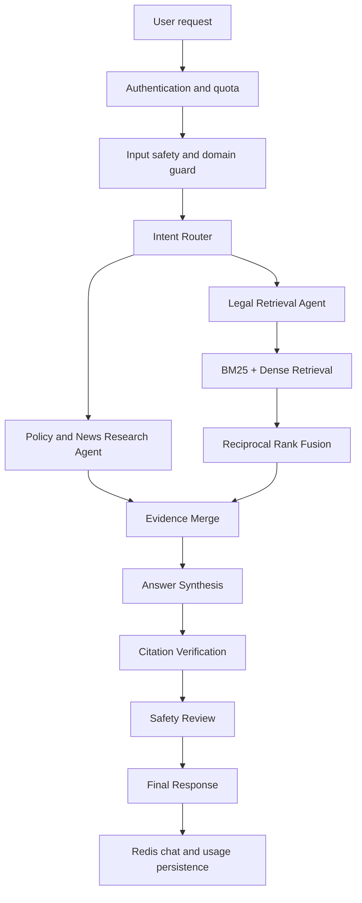

# MaiThuyLaw AI — Production Extension

> Quay lại tài liệu bài lab: [`../README.md`](../README.md)

MaiThuyLaw AI là ứng dụng tra cứu thông tin pháp luật, chính sách công và nguồn tin chính thống liên quan đến ma túy tại Việt Nam. Ứng dụng là một phần mở rộng độc lập sau final lab, có runtime, dependencies, tests, Dockerfile và Railway configuration riêng.

> Hệ thống cung cấp thông tin và tóm tắt dựa trên nguồn. Hệ thống không thay thế tư vấn pháp lý từ luật sư hoặc cơ quan có thẩm quyền.

## Capabilities

- FastAPI APIs cho chat, health, readiness, history, usage và source ingestion.
- Intent-routed deterministic multi-agent workflow.
- BM25 + dense hybrid retrieval với Reciprocal Rank Fusion.
- Controlled legal, policy và verified-news corpus.
- Google GenAI synthesis với cited offline fallback.
- Claim-level citation verification và grounded-response gates.
- Input/output safety controls và domain restriction.
- API-key restricted mode hoặc signed anonymous sessions.
- Redis-backed conversation history, quotas và token-cost accounting.
- File/link ingestion với type/size validation, allowlist và SSRF protection.
- React frontend được build và serve cùng production container.

## Architecture



Chi tiết: [`docs/architecture.md`](docs/architecture.md).

## Project structure

```text
maithuylaw-ai/
├── backend/                 FastAPI, workflow, retrieval, safety, persistence
├── frontend/                React/Vite client
├── data/                    Controlled RAG corpus
├── scripts/                 Index build, validation, evaluation, smoke tests
├── tests/                   Unit and integration tests
├── docs/                    Architecture, retrieval, safety and deployment docs
├── Dockerfile
├── docker-compose.yml
├── requirements.txt
├── railway.toml
└── .env.example
```

## Dataset and retrieval

| Metric | Value |
|---|---:|
| Chunks | 224 |
| Documents | 27 |
| Legal chunks | 182 |
| Policy chunks | 14 |
| News chunks | 28 |
| Dense dimensions | 384 |

The repository benchmark is a small regression set used to detect retrieval regressions. It is not a claim of general legal-QA accuracy. See [`docs/retrieval-evaluation.md`](docs/retrieval-evaluation.md).

## Local setup

Requirements:

- Python 3.12+
- Node.js 20+
- Redis recommended for shared persistence

```bash
cd maithuylaw-ai
python -m venv .venv
source .venv/bin/activate        # Windows: .venv\Scripts\activate
pip install -r requirements.txt

cd frontend
npm ci
npm run build
cd ..

python -m uvicorn backend.main:app --host 0.0.0.0 --port 8000
```

Or run the product stack separately from the lab app:

```bash
cd maithuylaw-ai
docker compose up -d --build
```

The product compose file exposes the application at `http://localhost:8001` to avoid conflicting with the root lab app on port `8000`.

## Environment variables

Copy `.env.example` to `.env.local`. Production values are set in Railway, not committed to Git.

Required for model synthesis:

```text
GEMINI_API_KEY
GEMINI_MODEL=gemini-3.1-flash-lite
```

Required for persistent production operation:

```text
MAITHUYLAW_SESSION_SECRET
REDIS_URL
MAITHUYLAW_ALLOWED_ORIGINS
```

Controlled realtime search remains disabled unless explicit user consent and server-side configuration are both present.

## Main APIs

| Method | Path | Purpose |
|---|---|---|
| `GET` | `/health` | Process and storage status |
| `GET` | `/ready` | Dataset and runtime readiness |
| `POST` | `/ask` | Compatibility Q&A endpoint |
| `POST` | `/api/chat` | Main grounded chat workflow |
| `GET` | `/history` | Compatibility chat-history endpoint |
| `GET` | `/usage` | Token and estimated-cost usage |
| `GET/POST` | `/api/chats` | List or create chats |
| `GET/PATCH/DELETE` | `/api/chats/{chat_id}` | Read, rename or delete a chat |
| `POST` | `/api/attachments/upload` | Validate and store an uploaded source |
| `POST` | `/api/attachments/link` | Validate and store an approved URL |

## Validation

```bash
cd maithuylaw-ai
python -m compileall -q backend scripts tests
python scripts/validate_dataset_manifest.py
python scripts/evaluate_retrieval.py
pytest -q

cd frontend
npm ci
npm run build
npm audit --audit-level=moderate
```

CI additionally builds the product Docker image, starts the container and runs the backend smoke test.

## Deployment

MaiThuyLaw AI is deployed as a separate Railway service/project from the original lab evidence. Configure Railway to use `maithuylaw-ai` as the service root directory, then follow [`docs/deployment.md`](docs/deployment.md).

The new public domain will be recorded only after the deployment passes `/health`, `/ready`, API and Redis-persistence smoke tests.

## Technical documentation

- [`docs/architecture.md`](docs/architecture.md)
- [`docs/retrieval-evaluation.md`](docs/retrieval-evaluation.md)
- [`docs/safety-and-citations.md`](docs/safety-and-citations.md)
- [`docs/deployment.md`](docs/deployment.md)
- [`docs/release-evidence.md`](docs/release-evidence.md)
